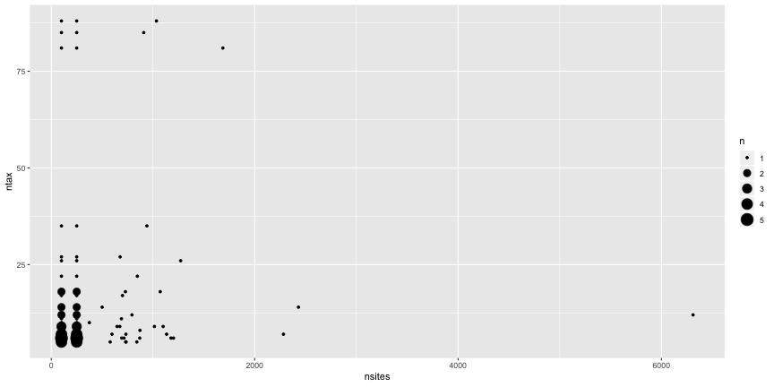

The recent article by [Abadi et al. (2019)](https://doi.org/10.1038/s41467-019-08822-w) argues that model selection is unnecessary, and that we should use the most complex model, GTR+I+G. This seems a bit too good to be true (for one thing, there are many more complex models than this -- DNA evolution can probably be described by more than six free parameters; for another, there is heterogeneity across genes that may be fit by partitioned models). I decided to dig into their results some more. They are great about having their scripts and data files available, though I could not easily find the trees used for generation of sequences. I did some quick analyses of their data, focusing on their c3 dataset (the most realistic model) and their empirical trees. Note for speed I'm initially using just a subset of their trees, but will do more after playing with this some more. You can see all the functions and approaches used at [https://github.com/bomeara/AbadiEtAl2019Response](https://github.com/bomeara/AbadiEtAl2019Response).

My first impression on looking at some of their data was that their empirical trees were rather small: models might work fine for a seven taxon tree, for example, but might not scale well. Their trees came from [PlantDB](http://www.plantgdb.org/), [Selectome](https://selectome.unil.ch/), and [PANDIT](https://www.ebi.ac.uk/research/goldman/software/pandit), which are particular databases that don't necessarily represent the trees used by most comparative biologists (for example, PANDIT has not been updated in 14 years). Thus, their results may be perfectly correct for trees in these databases, but should not be comforting to systematists who want to use DNA models for multiple species. As an independent source of these trees, I turned to Open Tree of Life, which has a database of over 4,000 trees deposited by systematists and other biologists.

Number of taxa in trees in Open Tree Of Life database (one per study) and number of taxa on Abadi et al. (2019). The median number of taxa in the Abadi et al. empirical trees was 9 (5, 86.6), while the median number in Open Tree of Life was 50 (8, 427.7) [numbers in parentheses are the 95% range of trees].

The data set sizes are small, too. Here are the number of taxa and number of sites (median number of sites is 250 (100, 1999.9)).

We can also compare Robinson-Foulds distances of trees from different tree inference methods and models with those from GTR+I+G with the full dataset (since I couldn't find the "true tree", I'm using distance to the tree with the best model as a measure of how good these other models are). If that model is good enough without having to select, then maybe things like UPGMA are good enough, or trees using fewer characters (just 100 and 250 characters, for example). Based on these results, you sacrifice something by giving up models entirely to use BioNJ or to have small datasets, but not much (and the standard error includes zero difference) -- even though in reality we work hard to get large datasets and use somewhat realistic models.

Based on all this, it seems to me that this work does indeed show that going through model selection on small trees, using models that top out at GTR+I+G in complexity, may not be needed since GTR+I+G will be chosen much of the time (which echos [Kelchner & Thomas' (2007)](https://doi.org/10.1016/j.tree.2006.10.004) [empirical result](https://www.sciencedirect.com/science/article/pii/S016953470600334X#fig3)). However, it might be premature to declare that model selection on the trees and datasets that are orders of magnitude larger than the ones they simulated is unnecessary.

These are my **preliminary impressions** after playing with their results. Note I also have a stake in developing models that go somewhat beyond GTR+I+G (paper in press) so I'm not an objective observer. However, given what we know about long branch attraction, the risks of model misspecification, and so forth, I wouldn't want to advise students to skip model selection, especially given large, heterogeneous datasets. But I'm really glad this paper was published -- we need more of this testing of our cultural practices in phylogenetics.

Brian O'Meara
