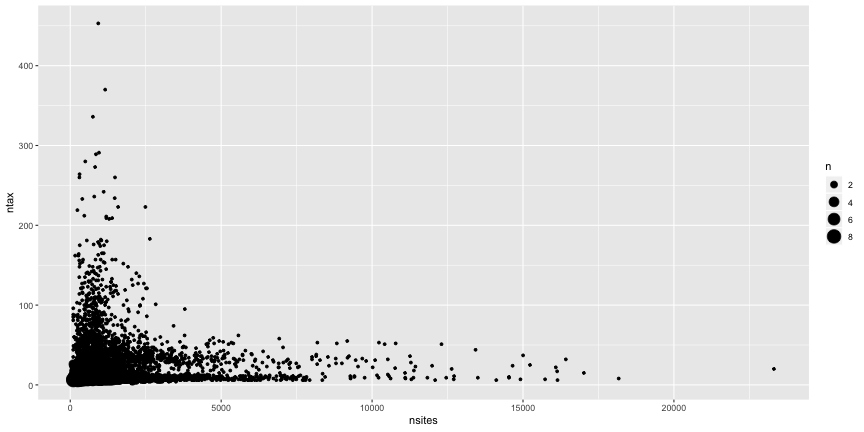

The recent article by [Abadi et al. (2019)](https://doi.org/10.1038/s41467-019-08822-w) argues that model selection is unnecessary, and that we should use the most complex model, GTR+I+G. This seems a bit too good to be true (for one thing, there are many more complex models than this -- DNA evolution can probably be described by more than six free parameters; for another, there is heterogeneity across genes that may be fit by partitioned models). I decided to dig into their results some more. They are great about having their scripts and data files available, though I could not easily find the trees used for generation of sequences. I did some quick analyses of their data, focusing on their c3 dataset (the most realistic model) and their empirical trees. Note for speed I'm initially using just a subset of their trees, but will do more after playing with this some more.

My first impression on looking at some of their data was that their empirical trees were rather small: models might work fine for a seven taxon tree, for example, but might not scale well. Their trees came from [PlantDB](http://www.plantgdb.org/), [Selectome](https://selectome.unil.ch/), and [PANDIT](https://www.ebi.ac.uk/research/goldman/software/pandit), which are particular databases that don't necessarily represent the trees used by most comparative biologists (for example, PANDIT has not been updated in 14 years). Thus, their results may be perfectly correct for trees in these databases, but should not be comforting to systematists who want to use DNA models for multiple species. As an independent source of these trees, I turned to Open Tree of Life, which has a database of over 4,000 trees deposited by systematists and other biologists.

Number of taxa in trees in Open Tree Of Life database (one per study) and number of taxa on Abadi et al. (2019). The median number of taxa in the Abadi et al. empirical trees was 9 (5, 86.6), while the median number in Open Tree of Life was 50 (8, 427.7) [numbers in parentheses are the 95% range of trees].

We can also compare distances of trees from different tree inference methods and models with those from GTR+I+G. If that model is good enough without having to select, then maybe things like UPGMA are good enough. Or trees using fewer characters.

