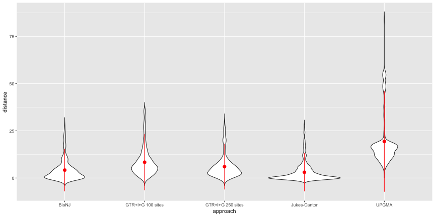

Number of taxa in trees in Open Tree Of Life database (one per study) in red; size of empirical trees in Abadi et al. (2019) in black.

We can also compare distances of trees from different tree inference methods and models with those from GTR+I+G. If that model is good enough without having to select, then maybe things like UPGMA are good enough. Or trees using fewer characters.

